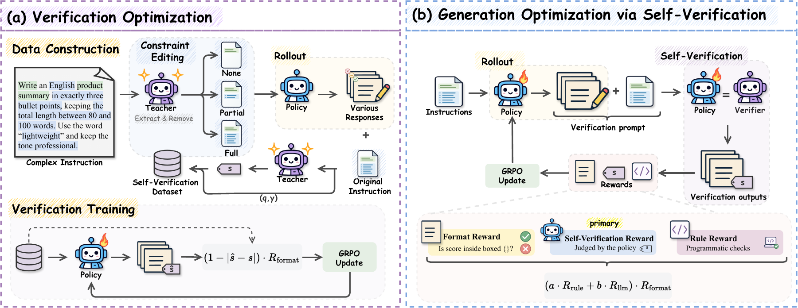

# PAVIF: Reinforcement Learning for Instruction Following with the Policy as Its Own Verifier

**PAVIF** (**P**olicy **a**s a **V**erifier for **I**nstruction **F**ollowing) is a two-stage reinforcement learning framework for instruction following that internalizes verification within the policy and uses its own verification feedback to optimize response generation.

- **Stage 1 — Verification Optimization:** Equips the policy with an initial capability to assess constraint satisfaction.
- **Stage 2 — Generation Optimization via Self-Verification:** Uses the same policy for both response generation and verification, with self-verification scores as the primary reward for GRPO.



## 🛠️ Installation

```bash
pip install -e .
```

## 🚀 Training

### 🔗 Ray cluster setup

Replace `10.0.0.1` with your head node's IP address in the commands below.

Start the Ray head node:

```bash
ray start --head --node-ip-address=10.0.0.1 --port=6379 --num-gpus=4
```

Run this command on **each worker node** to join the cluster:

```bash
ray start --address=10.0.0.1:6379 --num-gpus=4
```

Verify the cluster status:

```bash
ray status
```

### ⚙️ Training setup

The `examples/` directory contains training scripts for Qwen3-1.7B, Qwen3-4B, and Qwen3-8B. Run scripts from the repository root on the head node.

Data and outputs default to `data/` and `outputs/`. Set the Ray address, cluster size, data and output paths, and `MODEL_PATH` in the selected training script before running it:

```bash
HEAD_NODE="10.0.0.1"
NNODES=4
GPUS_PER_NODE=4
DATA_ROOT="./data"
OUTPUT_ROOT="./outputs"
MODEL_PATH="/path/to/Qwen3-4B-Instruct-2507"
```

Training parameters are configured in `examples/stage1.yaml` and `examples/stage2.yaml`. The actor KL loss coefficient is **0.08 for Stage 1** and **0.01 for Stage 2**. Explicit script arguments override YAML settings.

### 1️⃣ Stage 1: Verification Optimization

Set `worker.reward.compute_score` to `verification`.

```bash
bash examples/qwen3_4b_stage1.sh
```

### 2️⃣ Stage 2: Generation Optimization via Self-Verification

Set `worker.reward.compute_score` to `instruction`.

Set `MODEL_PATH` in `examples/qwen3_4b_stage2.sh` to the checkpoint exported from Stage 1. Replace `<step>` with the step number of your selected checkpoint:

```bash
MODEL_PATH="./outputs/checkpoints/instruct_stage1/qwen3_4b_stage1/global_step_<step>/actor/huggingface"
```

To start Stage 2, run the following command on the head node:

```bash
bash examples/qwen3_4b_stage2.sh
```

For additional training options, see [examples/stage1.yaml](examples/stage1.yaml) and [examples/stage2.yaml](examples/stage2.yaml).

## Code organization

Reward code is organized by purpose:

- Verification (Stage 1): `verl/utils/reward_score/verification.py` (scoring functions) and `verl/workers/reward/verification.py` (reward manager).
- Instruction generation (Stage 2): `verl/utils/reward_score/instruction_generation.py` (scoring functions) and `verl/workers/reward/instruction_generation.py` (reward manager).
- Shared helpers: `verl/utils/reward_score/_common.py` for constraint checks and `verl/workers/reward/_common.py` for decoding and rollout logs.

## 💐 Acknowledgments

Our implementation builds on [EasyR1](https://github.com/hiyouga/EasyR1), which is based on [veRL](https://github.com/volcengine/verl). We thank the [verl-if](https://github.com/Rainier-rq/verl-if) team for sharing their instruction-following data.
